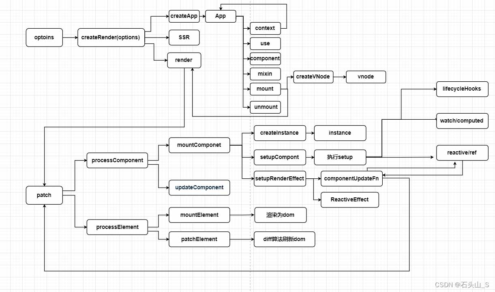
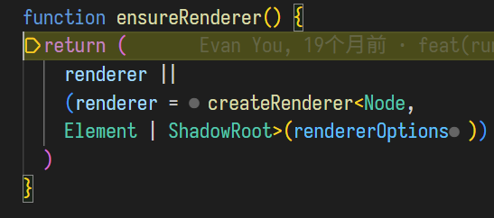
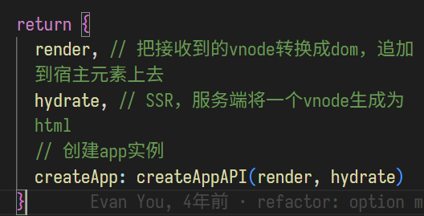
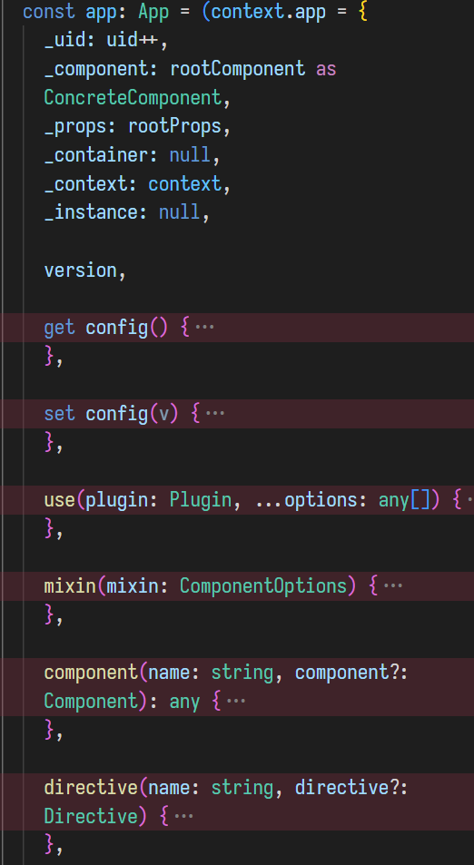

PS: 这是一张很有用的图

## 前言：怎样学习源码？
1. 有主线，两种方式
   1. 从入口入手，package.json-->
   2. 从逻辑入手，createApp()
2. 提出一个问题，在源码中找答案
3. 学习一步整理一步，然后复盘复习（画图）
4. 有所掌握后造轮子实践
5. 写博客或者做视频，在知识分享中巩固知识

## 首先提几个问题
- 第一个问题：app 实例如何创建？
- 第二个问题：app 实例中有些什么？

## 第一个问题：app 实例如何创建？


createApp() 函数内部的 ensureRenderer() 方法返回了一个渲染器 renderer（），这个 renderer 调用了 createApp() 创建实例。可以看到在 ensureRenderer() 方法内部调用了 createRenderer() 方法，进入其中会发现一个工厂函数 baseCreateRenderer()。
 
查看 baseCreateRenderer() 方法的实现，会发现它返回了一个方法 createAppAPI()，进入 createAppAPI() 方法内部，会发现这又是一个工厂函数，返回一个 createApp() 方法，而这就是图一中一开始调用的 createApp()。



## 第二个问题：app 实例中有些什么？
在 createAppAPI() 方法的实现代码中，我们可以找到实例 app 的实现，它包含了一些实例属性和实例方法，我们所熟悉的 use、mixin、component、directive、mount、unmount、provide 尽在其上


## 一些思考
可以发现，相比于 vue2 来说，vue3 将全局方法挂载到了实例 app 上（vue2 是挂载在构建函数 Vue 上），这样我们使用这些方法的方式发生了变化
```javascript
import myComponent from './vueSourceCodeStudy01/myComponent';
import myPlugin from './myPlugin';

// vue2
Vue.component('myComponent',myComponent);
Vue.use(myPlugin);

// vue3
createApp({...}).coponent(myComponent).use(myPlugin).mount('#app')
```
这样做有什么好处呢？我认为是为了应付多实例场景，这样做更加便于维护且清晰易懂。