## 前言
书接上回，在 runtime-core 包下的文件`/runtime-core/src/apiCreateApp.ts`中我们找到了 createAppAPI() 方法，此方法调用时创建一个 app 实例，在这个实例中挂载了一些我们熟悉的实例方法，`mount()`就在其中。

## 首先提几个问题
1. 初次挂载时 mount() 方法做了些什么？ 
2. 回忆一下 vue 的生命周期，mount() 方法在哪一部分执行了？


## 初次挂载时 mount() 方法干了些什么？


首先进入 mount() 方法，它接收 3 个参数：`rootContainer`，isHydrate，isSVG，我们这里只关注 rootContainer，因为初次挂载时的一般写法是：
```javascript
// 可以看到我们只传了一个字符串，是一个 CSS 选择器。
createApp({}).mount('#app')
```

再看方法体：
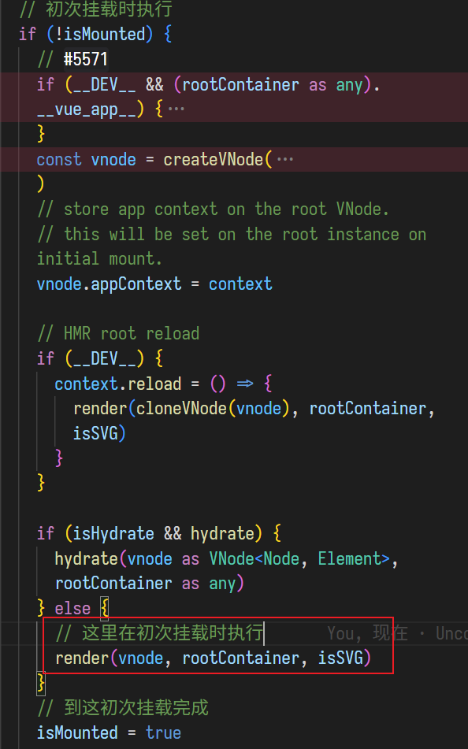

可以看到首先创建了一个 vnode，这个 vnode 由 createApp 方法传入的根组件确定；然后执行红框中的 render() 方法，我们传入的 rootContainer 作为第二个参数传入。

让我们看看这个 render 方法，它是 createAppAPI() 方法的第一个参数，上一章介绍过这是 baseCreateRenderer() 这个工厂函数的返回，它在`/runtime-core/src/renderer.ts`目录下可以找到。


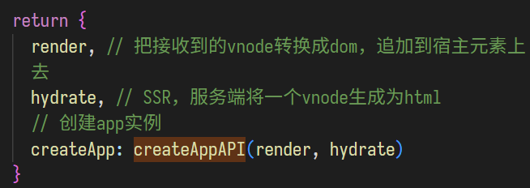

接下来找到 render() 方法的方法体：
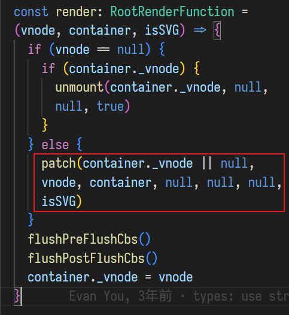

可以看到 render() 方法接收三个参数，初次挂载时 vnode 有值，container 是我们 mount() 方法传入的挂载节点。因为 vnode 存在，所以执行 else 部分，可以看到，这里使用了一个`patch()`方法

我们来看一下这个 patch() 方法中传了些什么：
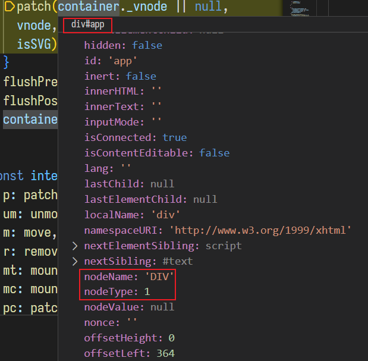

可以看出传入的 container 参数是一个 DOM 对象，在第一次挂载时指向`div#app`，我们的宿主对象，此时 container._vnode 值为 undefined（在 render 方法的最后才会给_vnode 属性赋值），所以第一个参数值为 null，第二个参数是之前传入的 vnode 对象，长这样：
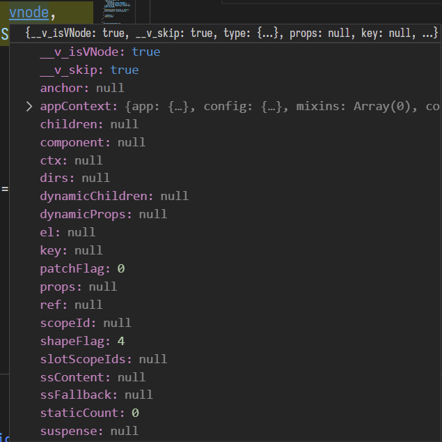

之后会用到，此时先不做关注。我们再来看看 patch() 方法内部：
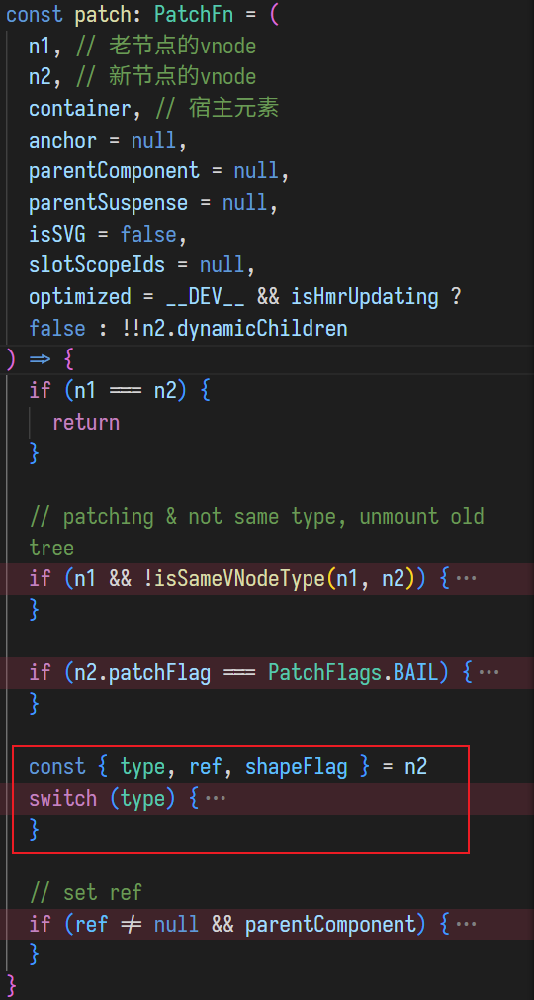

<!-- 
  YCNOTE：为什么 switch 语句要传入一个对象
 -->
沿着逻辑往下走到红框部分，此时从我们传入的 vnode（第一次挂载时 mount 方法中新建的 vnode) 中取出 3 个值，根据`type`和`shapeFlag`的值进行不同的操作：
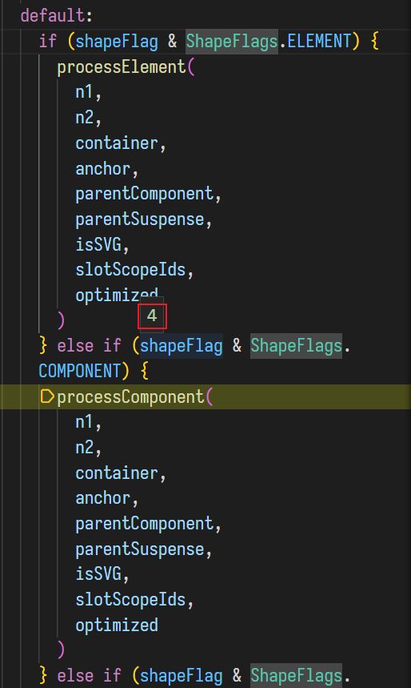

此时 shapeFlag 的值为 4，进行位与运算值为 true。以下`位移枚举`可以学一下，它的好处是清晰、好计算并且可以进行多值判断。
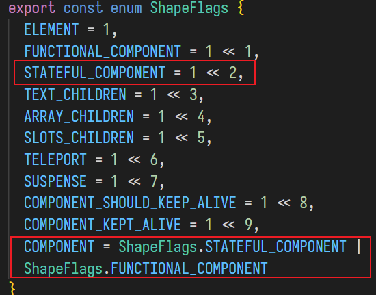

初次挂载时执行`processComponent()`方法，进入方法体 processComponent()：
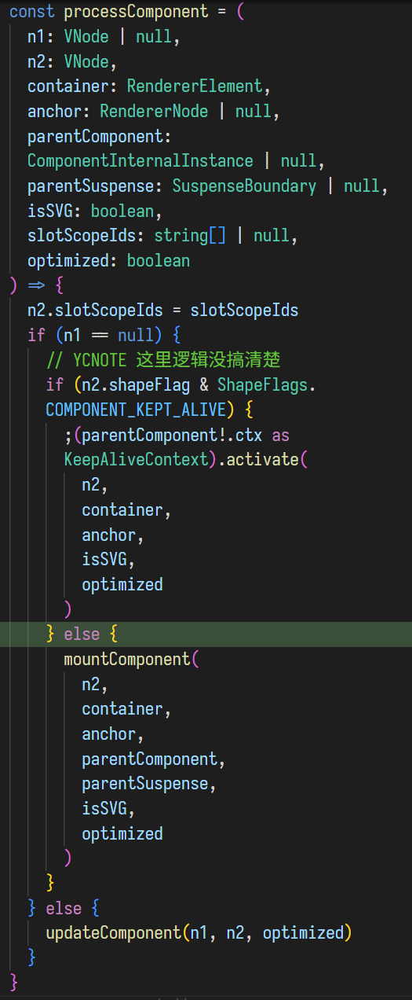

可以看到走进 else 代码块，触发方法`mountComponent()`，见名知意，组件由这个方法挂载。进入该方法，该方法首先会执行一个`setupRenderEffect()`方法，
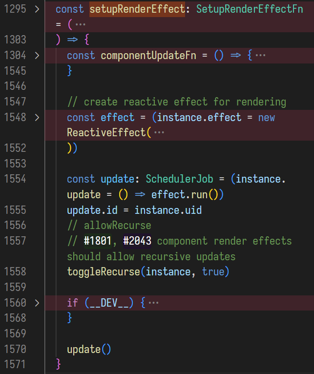

这个方法创建了一个执行器 `effect`，然后调用了 effect.run() 方法，当 effect.run() 执行完毕时，整个挂载流程结束。

## 总结

总结一下，初次挂载时 mount() 方法执行流程大概这样：

mount()-->createVNode()-->render()-->patch()-->processComponent()-->mountComponent()-->createComponentInstance-->setupRenderEffect()-->ReactiveEffect()-->update()-->effect.run()

简洁一点就是：

mount()-->render()-->patch()

可以通过调用堆栈查看：
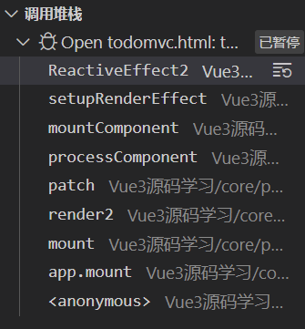

回到最初提的两个问题，第一个问题已经基本解答完毕，第二个问题，mount() 函数在 vue 的生命周期的哪一部分执行也已经可以推想出来：


本篇文章就到此为止，因为是初识，所以比较简单，基本上就是跟着调用栈走，之后会更具体的分析 render() 和 patch() 函数。

若有错误请大佬指出，感激不尽。
